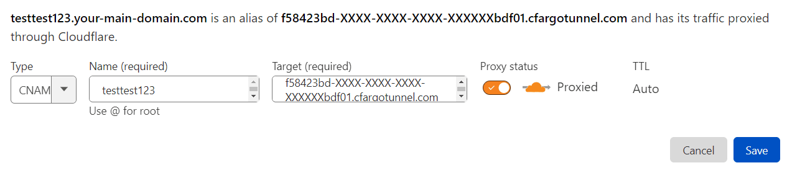

### Configure

* Copy the variables template via `cp ./template.env ./.env`
* Set the `CLOUDFLARED_TAG` within `./.env`, based on your arch

---

### Authorize Tunnel for Cloudflare Domain

* Execute `docker-compose run --rm cloudflared tunnel login`
* Copy the URL from the above command's output
* Paste the URL into your web browser
* Authorize the tunnel for `__MY_SITE__.__COM__`

---

### Create the Tunnel

* Execute `docker-compose run --rm cloudflared tunnel create __MY_SITE__`
* Copy the tunnel's UUID from the above command's output
* Execute the following to add your tunnel to `config.yaml`:
  ```shell
  TUNNEL_UUID='<PASTE FROM ABOVE>'
  DOMAIN='__MY_SITE__.__COM__'

  sudo tee ./mounts/cloudflared/config.yaml <<EOF >/dev/null
  tunnel: $TUNNEL_UUID
  ingress:
    - hostname: $DOMAIN
      service: http://nginx_proxy_manager:80
    - service: http_status:404
  EOF
  ```

---

Deploy via `docker-compose up -d`

---

### Configure Cloudflare DNS -> Tunnel

* On the Cloudflare website, open the DNS settings for `__MY_SITE__.__COM__`
* Modify the `CNAME` to `$TUNNEL_UUID.cfargotunnel.com`


---

### Deploy

`docker-compose up -d`

---

### Test the Tunnel

(note that the above DNS settings make take a second to propagate)

* Open `__MY_SITE__.__COM__` in your web browser
* You should see a page that says:

```
Congratulations!
You've successfully started the Nginx Proxy Manager.
If you're seeing this site then you're trying to access a host that isn't set up yet.
Log in to the Admin panel to get started.
```

---

### Citation

This readme was largely sourced from [here](https://www.sakowi.cz/blog/cloudflared-docker-compose-tutorial).
